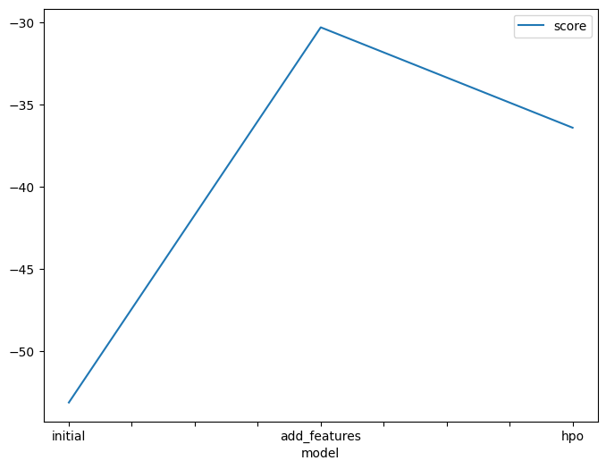
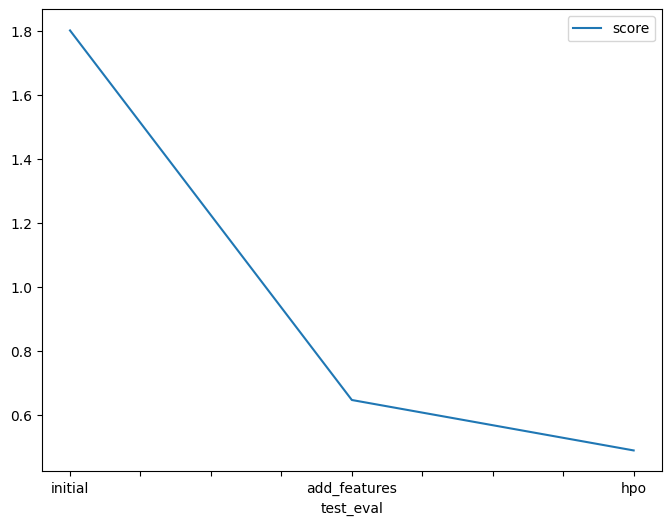

# Report: Predict Bike Sharing Demand with AutoGluon Solution
#### Tanmay Pawar

## Initial Training
### What did you realize when you tried to submit your predictions? What changes were needed to the output of the predictor to submit your results?
The predictions are count of bike. It can not be negative. Hence to submit we should first replace negative ( invalid) predictions with dummy value i.e. 0.

### What was the top ranked model that performed?
WeightedEnsemble_L3

## Exploratory data analysis and feature creation
### What did the exploratory analysis find and how did you add additional features?
Some features were having similar data distribution like,temp, atemp and humidity have similar distribution and casual, registered, count have similar distribution.

### How much better did your model preform after adding additional features and why do you think that is?
Model score after adding additional features improved from -53 to -30. 
The additional added features were, year, month, dayofweek and hour. 
Instead of whole date with a timestamp , seperate year , month, dayofweek and hour are more insightful as they can be more easly used to study and can help to generalize the relation with bike demand than a specific date

## Hyper parameter tuning
### How much better did your model preform after trying different hyper parameters?
the model score changed from -30 to -36 after hyperparameter tuning

### If you were given more time with this dataset, where do you think you would spend more time?
I will try to work on feature engineering and hyperparameter optimization

### Create a table with the models you ran, the hyperparameters modified, and the kaggle score.
|model|timelimit|preset|Hyperparameter|score|
|--|--|--|--|--|
|initial|600|best quality|none|1.80060|
|add_features|600|best quality|none|0.64693|
|hpo|600|best quality|Tabular Autogluon: num_boost_rounds=100(for GBM), no_epochs=8(for NN)|0.48946|

### Create a line plot showing the top model score for the three (or more) training runs during the project.

TODO: Replace the image below with your own.

### Create a line plot showing the top kaggle score for the three (or more) prediction submissions during the project.

TODO: Replace the image below with your own.

## Summary
TODO: Add your explanation
